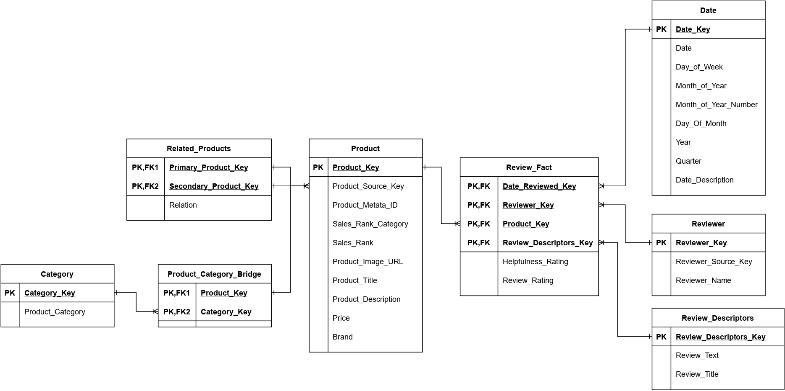

# Amazon Product Reviews Data Warehouse

To deploy the project run the following command in the root directory:

```
 docker compose up
```

The ETL pipelines will start executing once all the databases have been deployed. On average the full load of the data takes about _15 mins_. As this is only a demo, schedules cronjobs have been disabled.

Once all three pipelines have been executed you can run the following commands to query the data:

**Review Rating per category per month**

```
 docker exec -i db_adw psql -U user -d adw -c "
    SELECT
        c.product_category,
        d.year,
        d.month_of_year,
        AVG(rf.review_rating) AS avg_review_rating
    FROM
        review_fact rf
    JOIN
        product p ON rf.product_key = p.product_key
    JOIN
        product_category_bridge pcb ON p.product_key = pcb.product_key
    JOIN
        category c ON pcb.category_key = c.category_key
    JOIN
        date d ON rf.date_reviewed_key = d.date_key
    GROUP BY
        c.product_category, d.year, d.month_of_year
    ORDER BY
        d.year, d.month_of_year, c.product_category;
"

```

**Review Rating per brand per month**

```
 docker exec -i db_adw psql -U user -d adw -c "
    SELECT
        p.brand,
        d.year,
        d.month_of_year,
        AVG(rf.review_rating) AS avg_review_rating
    FROM
        review_fact rf
    JOIN
        product p ON rf.product_key = p.product_key
    JOIN
        date d ON rf.date_reviewed_key = d.date_key
    GROUP BY
        p.brand, d.year, d.month_of_year
    ORDER BY
        d.year, d.month_of_year, p.brand;
"
```

**Import metadata statistics**

```
docker exec -i db_adw psql -U user -d adw -c "
    DO $$
    DECLARE
        MAX_IB_ID INT;
    BEGIN
        -- Get the maximum IB_ID
        SELECT MAX(IB_ID) INTO MAX_IB_ID FROM Import_Batch;

        -- Retrieve the latest Import Batch
        PERFORM * FROM Import_Batch WHERE IB_ID = MAX_IB_ID;

        -- Retrieve the Import Batch Process associated with the latest IB_ID
        PERFORM * FROM Import_Batch_Process WHERE IB_ID = MAX_IB_ID;

        -- Retrieve Import Batch Process Tasks for the latest IB_ID
        PERFORM IBPT.*
        FROM Import_Batch_Process_Task AS IBPT
        INNER JOIN Import_Batch_Process AS IBP ON IBPT.IBP_ID = IBP.IBP_ID
        WHERE IBP.IB_ID = MAX_IB_ID;
    END $$;
"
```

## Data Profiling

### Product Reviews

| **Attribute Name** | **Description**                                                                               | **Datatype** | **Length** |
| ------------------ | --------------------------------------------------------------------------------------------- | ------------ | ---------- |
| _empty field_      | Field stores record index                                                                     | int          |
| reviewerID         | ID of the reviewer                                                                            | str          | 21         |
| asin               | ID of the product                                                                             | str          | 10         |
| reviewerName       | Username of the reviewer                                                                      | str          | med        |
| helpful            | Number of helpful votes for the review. Array should be interpreted as value1/value2 = rating | array(int)   | 2          |
| reviewText         | The text of the review                                                                        | str          | long       |
| overall            | Rating of the review                                                                          | float        |            |
| summary            | Title summary of the review                                                                   | str          | med        |
| unixReviewTime     | Unix timestamp of the review                                                                  | int          |            |
| reviewTime         | Converted date stamp of the review (MM DD, YYYY)                                              | str          | 11         |

### Product Metadata

| **Attribute Name** | **Description**                                                                              | **Datatype**      | **Length** | **Parent Field** |
| ------------------ | -------------------------------------------------------------------------------------------- | ----------------- | ---------- | ---------------- |
| metadataid         | Unique ID for product metadata                                                               | str               | 7          |                  |
| asin               | Unique ID for products                                                                       | str               | 10         |                  |
| salesrank          | Object containing the sales rank of products in a category                                   | object            |            |                  |
| Clothing           | Field indicating the rank of a product in a category. _The key of the field is the category_ | int               |            | salesrank        |
| imurl              | URL link to the image of a product                                                           | string            | long       |                  |
| categories         | List of categories to which a product belongs                                                | array(array(str)) |            |                  |
| title              | The name of a product                                                                        | str               | med        |                  |
| description        | Text description of a product                                                                | str               | long       |                  |
| price              | The cost of a product                                                                        | float             |            |                  |
| related            | Object containing arrays of related products                                                 | object            |            |                  |
| also_bought        | Array of product _asin_ IDs that was bought along with this product                          | array(str)        | str(10)    | related          |
| also_viewed        | Array of product _asin_ IDs that was viewed along with this product                          | array(str)        | str(10)    | related          |
| bought_together    | Array of product _asin_ IDs that was recommended with this product                           | array(str)        | str(10)    | related          |
| brand              | The brand of the product                                                                     | str               | med        |                  |

## Dimensional Modelling

### Four-step Modeling Process

1. Choose the Business Process

2. Declare the grain

3. Identify the Dimensions

4. Identify the Facts

### Bus Matrix

|                      |                | **Dimension Name**                                       |  Date  |   Reviewer    |   Product    |    Review Descriptors    |
| -------------------- | -------------- | -------------------------------------------------------- | :----: | :-----------: | :----------: | :----------------------: |
|                      |                | **Dimension Type**                                       |  Date  |  SCD Type 1   |  SCD Type 2  |           Junk           |
| **Business Process** | **Fact Table** | **Granularity**                                          | _Date_ | _Reviewer ID_ | _Product ID_ | _Indicators Combination_ |
| Product Reviews      | Review_Fact    | Insert a record each time a reivew is made for a product |   x    |       x       |      x       |            x             |

### ERD Diagram



### Atomic Data Warehouse Tables

#### Date

| **Column Name**      | **Description**                                               | **Data type** | **Key** | **Null Replacement** | **Example Value**     |
| -------------------- | ------------------------------------------------------------- | ------------- | ------- | -------------------- | --------------------- |
| Date_Key             | Key used to connect date dimension to fact table              | int           | PK      | 19000101             | 20180323              |
| Date                 | Date Representation as recorded in the source system          | date          |         | 1900/01/01           | 2018/03/23            |
| Day_Of_Week          | String representing the day of the week                       | nvarchar(10)  |         | Monday               | Friday                |
| Month_Of_Year        | String Representation of the month of the year                | nvarchar(10)  |         | January              | March                 |
| Month_Of_Year_Number | Integer value representing the month of the year              | int           |         | 01                   | 03                    |
| Day_Of_Month         | Integer representing the day of the month                     | int           |         | 01                   | 23                    |
| Year                 | Integer value representing the current year                   | int           |         | 1900                 | 2018                  |
| Quarter              | Number representing the quarter of the current financial year | int           |         | 1                    | 1                     |
| Date_Description     | String value representing the entire date                     | nvarchar(20)  |         | \*Unknown Date       | Friday, 23 March 2018 |

#### Reviewer

| **Column Name**     | **Description**                       | **Data type** | **Key** | **Null Replacement** | **Example Value** |
| ------------------- | ------------------------------------- | ------------- | ------- | -------------------- | ----------------- |
| Reviewer_Key        | Surrogate Key for reviewers           | int           | PK      | -1                   | 2309              |
| Reviewer_Source_Key | Source system unique ID for reviewers | nvarchar(21)  |         | \*Unknown            | A1KLRMWW2FWPL4    |
| Reviewer_Name       | Username of a reviewer                | text          |         | \*Unknown Username   | design maven      |

#### Product

| **Column Name**     | **Description**                                           | **Data type** | **Key** | **Null Replacement** | **Example Value**                        |
| ------------------- | --------------------------------------------------------- | ------------- | ------- | -------------------- | ---------------------------------------- |
| Product_Key         | Surrogate key for products                                | int           | PK      |                      | 523                                      |
| Product_Source_Key  | Source system unique identifier for products              | nvarchar(10)  | BK      | \*None               | B001DL0QOA                               |
| Product_Metadata_ID | Metadata unqiue identifier for products                   | nvarchar(7)   | BK      | \*None               | 3105292                                  |
| Sales_Rank_Category | The category in which the sales of this product is ranked | nvarchar(50)  |         | \*Unknown category   | Clothing                                 |
| Sales_Rank          | The rank of a product in its sales category               | int           |         | -1                   | 1200                                     |
| Product_Image_URL   | URL link to an image of the product                       | nvarchar(225) |         | \*Unkown URL         | http://ecx.images-amazon.com/images...   |
| Product_Title       | The name of a product                                     | text          |         | \*Unkown title       | Lewis N. Clark TSA Cable LockName        |
| Product_Description | Description of a product                                  | text          |         | \*Unkown description | The Flash Costume from Justice League... |
| Price               | The price of an item                                      | float         |         | -1.00                | 17.23                                    |
| Brand               | The brand of a product                                    | nvarchar(150) |         | \*Unknown brand      | Rubie&#39;s Costume Co                   |

##### Related_Products (Auxiliary table)

| **Column Name**       | **Description**                            | **Data type** | **Key** | **Null Replacement** | **Example Value**    |
| --------------------- | ------------------------------------------ | ------------- | ------- | -------------------- | -------------------- |
| Primary_Product_Key   | Primary Product in a related relationship  | int           | PK, FK  |                      | 552                  |
| Secondary_Product_Key | Secondary Product in a related relationsip | int           | PK, FK  |                      | 1602                 |
| Relation              | The type of relation a two products have   | nvarchar(20)  |         |                      | Recommended together |

##### Category (Auxiliary table)

| **Column Name**  | **Description**                      | **Data type** | **Key** | **Null Replacement** | **Example Value**         |
| ---------------- | ------------------------------------ | ------------- | ------- | -------------------- | ------------------------- |
| Category_Key     | Surrogate key for product categories | int           | PK      |                      | 901                       |
| Product_Category | The category of a product            | nvarchar(150) |         |                      | Clothing, Shoes & Jewelry |

##### Product_Category_Bridge (Bridge table)

| **Column Name** | **Description**                                      | **Data type** | **Key** | **Null Replacement** | **Example Value** |
| --------------- | ---------------------------------------------------- | ------------- | ------- | -------------------- | ----------------- |
| Product_Key     | Key of a product in a product-category relationship  | int           | PK, FK  |                      | 789               |
| Category_Key    | Key of a category in a product-category relationship | int           | PK, FK  |                      | 1506              |

#### Review_Descriptors

Junk Dimension

| **Column Name**        | **Description**                      | **Data type** | **Key** | **Null Replacement**   | **Example Value**               |
| ---------------------- | ------------------------------------ | ------------- | ------- | ---------------------- | ------------------------------- |
| Review_Descriptors_Key | Surrogate key for review descriptors | int           | PK      |                        | 523                             |
| Review_Text            | The text of a review                 | nvarchar(225) |         | \*Unknown review text  | Great tutu for a great price... |
| Review_Title           | The title of a review                | nvarchar(150) |         | \*Unknown review title | Great value                     |

#### Review_Fact

| **Column Name**        | **Description**                                       | **Data type** | **Null Allowed** | **FK to**          | **Example Value** |
| ---------------------- | ----------------------------------------------------- | ------------- | ---------------- | ------------------ | ----------------- |
| Date_Reviewed_Key      | Key to the date dimension for when a review was made  | int           |                  | Date               | 20180323          |
| Reviewer_Key           | Key to the reviewer dimension                         | int           |                  | Reviewer           | 223               |
| Product_Key            | Key to the product dimension                          | int           |                  | Product            | 5778              |
| Review_Descriptors_Key | Key to the review descriptors junk dimension          | int           |                  | Review_Descriptors | 801               |
| Helpfulness_Rating     | The helpfullnes rating of a review (non-additve fact) | float         | Yes              |                    | 0.75              |
| Review_Rating          | The rating a review received                          | float         | Yes              |                    | 4.0               |

### Staging Tables

#### Stage 1

In the Stage 1 database data is loaded as-is from source files. Null replacement is performed, and many to many relationships are replicated in tables.

##### S1_Review

| **Column Name**       | **Description**                         | **Data type** | **Null Allowed** | **Null Replacement**   |
| --------------------- | --------------------------------------- | ------------- | ---------------- | ---------------------- |
| R_Reviewer_Source_Key | Source system unique key for a reviewer | nvarchar(21)  |                  | \*Unknown              |
| R_Product_Key         | Source system unique key for a product  | nvarchar(10)  |                  |                        |
| R_Reviewer_Name       | Name of a reviewer                      | text          |                  | \*Unknown username     |
| R_Helpful_Rating      | Number of helpful votes                 | float         | Yes              |                        |
| R_Review_Text         | Text of a review                        | text          |                  | \*Unknown review text  |
| R_Review_Score        | The score a review received             | float         | Yes              |                        |
| R_Review_Title        | The title of a review                   | text          |                  | \*Unknown review title |
| R_Review_DateTime     | The date time a review was made         | datetime      |                  | 1900/01/01             |

##### S1_Product

| **Column Name**       | **Description**                                    | **Data type** | **Null Allowed** | **Null Replacement** |
| --------------------- | -------------------------------------------------- | ------------- | ---------------- | -------------------- |
| P_Product_Metadata_ID | Metadata ID of a product                           | nvarchar(7)   |                  | \*None               |
| P_Product_Source_Key  | Source system unqiue identifier for a product      | nvarchar(10)  |                  | \*None               |
| P_Sales_Rank_Category | Category in which the sales of a product is ranked | nvarchar(50)  |                  | \*Unknown category   |
| P_Sales_Rank          | The sales rank of a product                        | int           |                  | -1                   |
| P_Image_URL           | The image URL of a product                         | nvarchar(225) |                  | \*Unkown URL         |
| P_Title               | The title of a product                             | tect          |                  | \*Unkown title       |
| P_Description         | The description of a product                       | text          |                  | \*Unkown description |
| P_Price               | The price of a product                             | float         |                  | -1.00                |
| P_Brand               | The brand of a product                             | nvarchar(150) |                  | \*Unknown brand      |

##### S1_Product_Category

| **Column Name**       | **Description**                               | **Data type** | **Null Allowed** | **Null Replacement** |
| --------------------- | --------------------------------------------- | ------------- | ---------------- | -------------------- |
| PC_Product_Source_Key | Source system unqiue identifier for a product | nvarchar(10)  |                  |                      |
| PC_Category           | The category of a product                     | nvarchar(150) |                  | \*No Category        |

##### S1_Related_Products

| **Column Name**               | **Description**                               | **Data type** | **Null Allowed** | **Null Replacement** |
| ----------------------------- | --------------------------------------------- | ------------- | ---------------- | -------------------- |
| RL_Product_Source_Key         | Source system unqiue identifier for a product | nvarchar(10)  |                  |                      |
| RL_Related_Product_Source_Key | Source system unqiue identifier for a product | nvarchar(10)  |                  |                      |
| RL_Relation                   | The type of relation a two products have      | nvarchar(20)  |                  |                      |

#### Stage 2

In the Stage 2 database referential integrity is checked between entities and deduplication is performed. If an entity would point to a non-existant entity, say a review points to an unkown product, a temporary empty product is created. In the final loading phase these entities are matched with entities present in the ADW, and unmatched records are inserted as late arriving dimensions/facts.

##### S2_Review

| **Column Name**       | **Description**                         | **Data type** | **Null Allowed** | **Key** |
| --------------------- | --------------------------------------- | ------------- | ---------------- | ------- |
| R_Reviewer_Source_Key | Source system unique key for a reviewer | nvarchar(21)  |                  | PK      |
| R_Product_Key         | Source system unique key for a product  | nvarchar(10)  |                  | PK, FK  |
| R_Reviewer_Name       | Name of a reviewer                      | nvarchar(100) |                  |         |
| R_Helpful_Rating      | Rating of helpfulness of a review       | float         | Yes              |         |
| R_Review_Text         | Text of a review                        | nvarchar(225) |                  |         |
| R_Review_Score        | The score a review received             | float         | Yes              |         |
| R_Review_Title        | The title of a review                   | nvarchar(150) |                  |         |
| R_Review_DateTime     | The date time a review was made         | datetime      |                  |         |

##### S2_Product

| **Column Name**       | **Description**                                    | **Data type** | **Null Allowed** | **Key** |
| --------------------- | -------------------------------------------------- | ------------- | ---------------- | ------- |
| P_Product_Metadata_ID | Metadata ID of a product                           | nvarchar(7)   |                  | PK      |
| P_Product_Source_Key  | Source system unqiue identifier for a product      | nvarchar(10)  |                  | PK      |
| P_Sales_Rank_Category | Category in which the sales of a product is ranked | nvarchar(50)  |                  |         |
| P_Sales_Rank          | The sales rank of a product                        | int           |                  |         |
| P_Image_URL           | The image URL of a product                         | nvarchar(225) |                  |         |
| P_Title               | The title of a product                             | text          |                  |         |
| P_Description         | The description of a product                       | text          |                  |         |
| P_Price               | The price of a product                             | float         |                  |         |
| P_Brand               | The brand of a product                             | nvarchar(150) |                  |         |

##### S2_Product_Category

| **Column Name**       | **Description**                               | **Data type** | **Null Allowed** | **Key** |
| --------------------- | --------------------------------------------- | ------------- | ---------------- | ------- |
| PC_Product_Source_Key | Source system unqiue identifier for a product | nvarchar(10)  |                  | PK ,FK  |
| PC_Category           | The category of a product                     | nvarchar(150) |                  | PK      |

##### S2_Related_Products

| **Column Name**               | **Description**                               | **Data type** | **Null Allowed** | **Key** |
| ----------------------------- | --------------------------------------------- | ------------- | ---------------- | ------- |
| RL_Product_Source_Key         | Source system unqiue identifier for a product | nvarchar(10)  |                  | PK, FK  |
| RL_Related_Product_Source_Key | Source system unqiue identifier for a product | nvarchar(10)  |                  | PK, FK  |
| RL_Relation                   | The type of relation a two products have      | nvarchar(20)  |                  | PK,     |

### Process Metadata Tables

#### Import_Batch

| **Column Name** | **Description**              | **Data type** | **Null Allowed** | **Key** |
| --------------- | ---------------------------- | ------------- | ---------------- | ------- |
| IB_ID           | ID of import batch           | int           |                  | PK      |
| IB_Description  | Description of import action | nvarchar(50)  |                  |         |
| IB_Year         | Batch year                   | int           |                  |         |
| IB_Month        | Batch month                  | int           |                  |         |
| IB_Start        | Start date time              | datetime      |                  |         |
| IB_End          | End date time                | datetime      | Yes              |         |
| IB_Status       | Running, Failed, Completed   | nvarchar(10)  |                  |         |

#### Import_Batch_Process

| **Column Name** | **Description**              | **Data type** | **Null Allowed** | **Key** |
| --------------- | ---------------------------- | ------------- | ---------------- | ------- |
| IBP_ID          | ID of import batch process   | int           |                  | PK      |
| IP_ID           | ID of import batch           | int           |                  | FK      |
| IB_Description  | Description of import action | nvarchar(50)  |                  |         |
| IB_Start        | Start date time              | datetime      |                  |         |
| IB_End          | End date time                | datetime      | Yes              |         |
| IB_Status       | Running, Failed, Completed   | nvarchar(10)  |                  |         |

#### Import_Batch_Process_Task

| **Column Name**      | **Description**                 | **Data type** | **Null Allowed** | **Key** |
| -------------------- | ------------------------------- | ------------- | ---------------- | ------- |
| IBPT_ID              | ID of import batch process task | int           |                  | PK      |
| IBP_ID               | ID of import batch process      | int           |                  | FK      |
| IB_Description       | Description of import action    | nvarchar(50)  |                  |         |
| IB_Start             | Start date time                 | datetime      |                  |         |
| IB_End               | End date time                   | datetime      | Yes              |         |
| IB_Status            | Running, Failed, Completed      | nvarchar(10)  |                  |         |
| IBPT_Records_In      | Number of new records           | int           | Yes              |         |
| IBPT_Records_Failed  | Number of failed records        | int           | Yes              |         |
| IBPT_Records_Out     | Number of records loaded        | int           | Yes              |         |
| IBPT_Records_Type_2  | Number of SCD Type 2 updates    | int           | Yes              |         |
| IBPT_Records_Type_1  | Number of SCD Type 1 updates    | int           | Yes              |         |
| IBPT_Records_Dim_New | Number of new Dimension records | int           | Yes              |         |

## ETL Pipelines

The ETL system in this project makes use of python microservices to migrate data between a series of staging tables. Each staging table has a distinct purpose and contributes to transforming the data.

### ETL scheduling

The ETL microservices are scheduled to start executing using a cronjob. The cornjob starts the first service (etl_ingest). Once the etl_ingest service is done, it notifies the second service, stage_1_to_stage_2 to kick of. Finally, the stage_2_to_adw service loads the final staging data.

### Micorservices

#### ETL Ingest

Key features:

1. Replaces Empty values
2. Sanitzes strings
3. Checks for malformed records
4. Captures metadata

#### Stage_1_to_Stage_2

Key features:

1. Selectes unique values from S1 views
2. Enforces referential integrity

#### Stage_2_to_adw

Key features:

1. Surrogate key pipeline
2. Applies type 1 and type 2 Slowly Changeing dimensions

### Optimizations

- All data is processed in batches, and where data needs to be SQL inserted, a cursor is used to create a batch insert.
- The ingest pipeline is created to read data from a flat file, which is also batched.
- All operations maintain linnear compute time, that is for every row, _O_, _n_ transformations are made (O(n)).
- Because the processing of each stage is made in a microservice, the microservices can be scaled independently, and compute can be allocated as desired.
